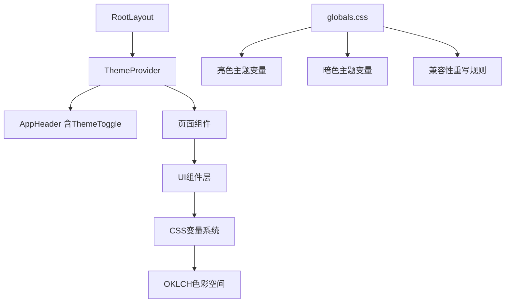
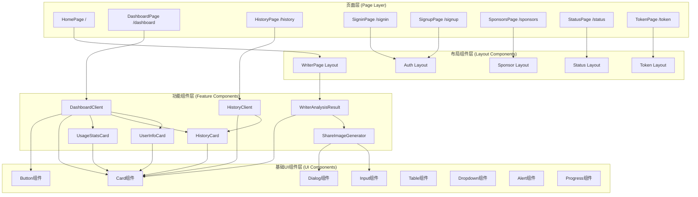
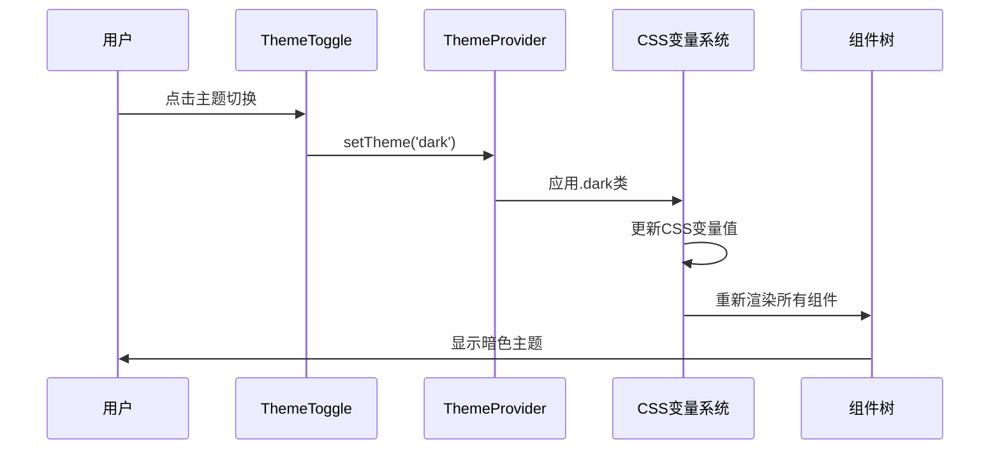
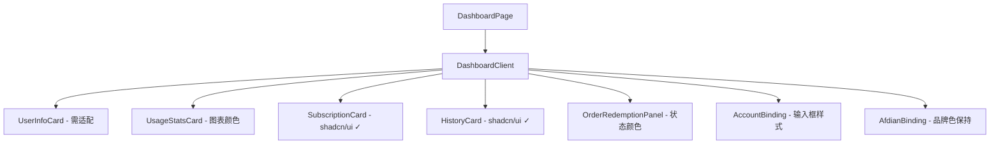
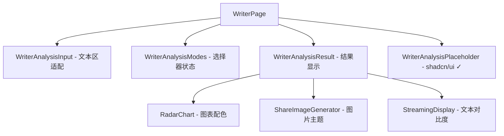
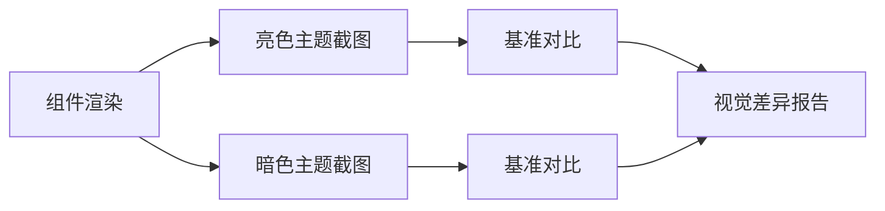

# Dark主题实现设计文档

## 1. 项目概述

Ink Battles项目是一个基于Next.js 15的全栈AI文本分析工具，当前已具备基础的主题切换功能，使用`next-themes`库和CSS变量实现明暗主题切换。本设计文档旨在全面优化dark主题的实现，确保所有前端页面和组件在暗色模式下具有优秀的视觉体验和可读性。

### 1.1 当前主题实现状态



### 1.2 技术架构特点

- **主题管理**: 基于`next-themes`实现主题状态管理
- **颜色系统**: 使用OKLCH色彩空间确保色彩一致性
- **组件体系**: 基于Radix UI + shadcn/ui的三层组件架构
- **样式系统**: Tailwind CSS 4 + CSS变量主题系统
- **辅助工具**: UnoCSS仅用于@antfu的eslint配置，不作为主要样式方案
- **状态持久化**: 主题状态自动存储至localStorage

## 2. 架构分析

### 2.1 组件层级关系



### 2.2 主题系统架构



## 3. 色彩系统设计

### 3.1 OKLCH颜色规范

| 语义化颜色 | 亮色模式 | 暗色模式 | 用途说明 |
|------------|----------|----------|----------|
| --background | oklch(1 0 0) | oklch(0.145 0 0) | 页面主背景色 |
| --foreground | oklch(0.145 0 0) | oklch(0.985 0 0) | 主要文本色 |
| --card | oklch(1 0 0) | oklch(0.205 0 0) | 卡片背景色 |
| --card-foreground | oklch(0.145 0 0) | oklch(0.985 0 0) | 卡片文本色 |
| --primary | oklch(0.205 0 0) | oklch(0.922 0 0) | 主要交互色 |
| --secondary | oklch(0.97 0 0) | oklch(0.269 0 0) | 次要背景色 |
| --muted | oklch(0.97 0 0) | oklch(0.269 0 0) | 静默状态色 |
| --accent | oklch(0.97 0 0) | oklch(0.269 0 0) | 强调色 |
| --destructive | oklch(0.577 0.245 27.325) | oklch(0.704 0.191 22.216) | 危险操作色 |
| --border | oklch(0.922 0 0) | oklch(1 0 0 / 10%) | 边框色 |

### 3.2 扩展色彩变量

```css
:root {
  /* 现有变量保持不变 */
  
  /* 新增语义化色彩变量 */
  --success: oklch(0.55 0.18 145);
  --warning: oklch(0.75 0.15 85);
  --info: oklch(0.6 0.12 240);
  --surface-1: oklch(0.985 0 0);
  --surface-2: oklch(0.97 0 0);
  --surface-3: oklch(0.94 0 0);
}

.dark {
  /* 现有变量保持不变 */
  
  /* 暗色模式下的扩展变量 */
  --success: oklch(0.65 0.15 145);
  --warning: oklch(0.8 0.12 85);
  --info: oklch(0.7 0.1 240);
  --surface-1: oklch(0.25 0 0);
  --surface-2: oklch(0.22 0 0);
  --surface-3: oklch(0.19 0 0);
}
```

## 4. 组件主题优化

### 4.1 Shadcn/UI组件状态

项目中的大部分基础UI组件来自shadcn/ui，这些组件已经内置了完善的dark mode支持：

**已完成dark mode的shadcn/ui组件：**
- Button、Card、Dialog、Input等核心组件
- Dropdown Menu、Select、Table、Tabs等复合组件
- Avatar、Badge、Progress、Switch等装饰组件
- Alert、Separator、Skeleton等辅助组件

这些组件使用CSS变量系统，会自动适配明暗主题，无需额外处理。

### 4.2 需要自定义适配的组件

以下是需要重点关注dark主题适配的自定义组件：

#### NoticeBar组件 (notice-bar.tsx)
当前使用硬编码的黄色系配色，需要适配暗色主题：

```tsx
// 当前实现 - 硬编码颜色
<div className="text-amber-900 px-4 py-3 border-b border-yellow-200 flex w-full whitespace-nowrap shadow-sm items-center justify-center overflow-hidden from-yellow-50 to-amber-50 bg-gradient-to-r">

// 建议修改 - 使用CSS变量
<div className="text-amber-900 dark:text-amber-100 px-4 py-3 border-b border-yellow-200 dark:border-yellow-800 flex w-full whitespace-nowrap shadow-sm items-center justify-center overflow-hidden from-yellow-50 to-amber-50 dark:from-yellow-900/30 dark:to-amber-900/30 bg-gradient-to-r">
```

#### PasswordStrengthIndicator组件 (password-strength.tsx)
包含多个硬编码颜色，需要系统性适配：

```tsx
// 需要适配的区域
1. 容器背景: "bg-white/70 backdrop-blur" -> "bg-white/70 dark:bg-gray-800/70 backdrop-blur"
2. 文本颜色: "text-slate-700" -> "text-slate-700 dark:text-slate-200"
3. 进度条背景: "bg-slate-200/70" -> "bg-slate-200/70 dark:bg-slate-700/70"
4. 徽章背景: 需要为所有状态徽章添加暗色变体
```

#### UserTierInfo组件 (user-tier-info.tsx)
徽章颜色和卡片内容需要暗色适配：

```tsx
// 需要优化的颜色系统
const getBadgeColors = (userType: UserType) => {
  switch (userType) {
    case UserType.GUEST:
      return "text-gray-600 dark:text-gray-300 bg-gray-50 dark:bg-gray-800 border-gray-200 dark:border-gray-700";
    case UserType.REGULAR:
      return "text-blue-600 dark:text-blue-400 bg-blue-50 dark:bg-blue-900/30 border-blue-200 dark:border-blue-800";
    case UserType.MEMBER:
      return "text-yellow-700 dark:text-yellow-300 bg-gradient-to-r from-yellow-100 to-orange-100 dark:from-yellow-900/30 dark:to-orange-900/30 border-yellow-300 dark:border-yellow-700";
  }
};
```

## 5. 页面级主题实现

### 5.1 自定义组件优化方案

基于识别的需要处理的组件，提供具体的实现方案：

#### NoticeBar组件改进
```tsx
export default function NoticeBar({ message, link }: NoticeBarProps) {
  return (
    <div className="px-4 py-3 border-b flex w-full whitespace-nowrap shadow-sm items-center justify-center overflow-hidden bg-gradient-to-r text-amber-900 border-yellow-200 from-yellow-50 to-amber-50 dark:text-amber-100 dark:border-yellow-800 dark:from-yellow-900/30 dark:to-amber-900/30">
      <div className="animate-marquee flex min-w-full items-center justify-center">
        {link ? (
          <a 
            href={link} 
            target="_blank" 
            rel="noopener noreferrer" 
            className="font-medium text-center underline w-full block transition-colors hover:text-amber-700 dark:hover:text-amber-200"
          >
            {message}
          </a>
        ) : (
          <span className="font-medium text-center w-full block">{message}</span>
        )}
      </div>
    </div>
  );
}
```

#### PasswordStrengthIndicator优化
```tsx
// 容器背景适配
<div className={`p-3 border rounded-lg backdrop-blur space-y-3 sm:p-4 bg-white/70 dark:bg-gray-800/70 border-gray-200 dark:border-gray-700 ${className}`}>

// 文本颜色适配
<div className="text-sm font-medium text-slate-700 dark:text-slate-200">密码要求（满足任意两项即可）</div>

// 徽章状态适配
<div className={`text-xs px-2 py-0.5 border rounded-full ${
  categoriesMet >= 2 
    ? "text-green-700 dark:text-green-300 border-green-200 dark:border-green-700 bg-green-50 dark:bg-green-900/30" 
    : "text-amber-700 dark:text-amber-300 border-amber-200 dark:border-amber-700 bg-amber-50 dark:bg-amber-900/30"
}`}>

// 进度条背景适配
<div className="rounded-full h-1.5 w-full bg-slate-200/70 dark:bg-slate-700/70">
```

#### UserTierInfo颜色系统
```tsx
const getTierColors = (userType: UserType) => {
  const colors = {
    [UserType.GUEST]: "text-gray-600 dark:text-gray-300 bg-gray-50 dark:bg-gray-800 border-gray-200 dark:border-gray-700",
    [UserType.REGULAR]: "text-blue-600 dark:text-blue-400 bg-blue-50 dark:bg-blue-900/30 border-blue-200 dark:border-blue-800",
    [UserType.MEMBER]: "text-yellow-700 dark:text-yellow-300 bg-gradient-to-r from-yellow-100 to-orange-100 dark:from-yellow-900/30 dark:to-orange-900/30 border-yellow-300 dark:border-yellow-700"
  };
  return colors[userType];
};
```

### 5.2 页面级布局适配策略

#### 仪表板页面 (Dashboard)


**重点优化项：**
- UserInfoCard中的自定义徽章颜色系统
- UsageStatsCard的数据可视化配色
- OrderRedemptionPanel的状态指示器
- 第三方集成组件的容器适配

#### WriterPage核心分析界面


**核心适配重点：**
- 文本输入区域的背景和边框适配
- 流式结果显示的字体对比度优化
- 雷达图配色的暗色模式方案
- 分享图片生成器的主题感知

#### 认证页面 (Auth)
主要使用shadcn/ui组件，重点关注：
- 表单容器背景适配
- QQ登录等第三方按钮样式
- 错误提示信息的对比度
- NoticeBar组件的适配（如有使用）

### 5.3 特殊功能组件处理

### 5.4 数据可视化组件

**RadarChart图表配色：**
```javascript
const chartColors = {
  light: {
    grid: '#e5e7eb',
    text: '#374151',
    fill: 'rgba(59, 130, 246, 0.1)',
    stroke: '#3b82f6'
  },
  dark: {
    grid: '#4b5563',
    text: '#d1d5db', 
    fill: 'rgba(96, 165, 250, 0.1)',
    stroke: '#60a5fa'
  }
};
```

**UsageStatsCard数据图表：**
- 进度条颜色使用CSS变量
- 统计数字的对比度优化
- 图表背景适配暗色模式

## 7. 高级主题特性

### 7.1 动画与过渡效果

```css
/* 增强的主题切换动画 */
@layer utilities {
  .theme-transition {
    transition: 
      background-color 0.3s cubic-bezier(0.4, 0, 0.2, 1),
      border-color 0.3s cubic-bezier(0.4, 0, 0.2, 1),
      color 0.3s cubic-bezier(0.4, 0, 0.2, 1),
      box-shadow 0.3s cubic-bezier(0.4, 0, 0.2, 1);
  }
  
  .glass-morphism {
    backdrop-filter: blur(16px) saturate(180%);
    background: rgba(255, 255, 255, 0.85);
    border: 1px solid rgba(255, 255, 255, 0.3);
  }
  
  .dark .glass-morphism {
    background: rgba(17, 25, 40, 0.85);
    border: 1px solid rgba(255, 255, 255, 0.125);
  }
}
```

### 7.2 可访问性增强

```css
/* 高对比度模式支持 */
@media (prefers-contrast: high) {
  :root {
    --border: oklch(0.5 0 0);
    --ring: oklch(0.3 0 0);
  }
  
  .dark {
    --border: oklch(0.7 0 0);
    --ring: oklch(0.8 0 0);
  }
}

/* 减少动画偏好 */
@media (prefers-reduced-motion: reduce) {
  .theme-transition {
    transition: none;
  }
}
```

### 7.3 系统主题检测优化

```tsx
// 增强的ThemeProvider配置
<ThemeProvider
  attribute="class"
  defaultTheme="system"
  enableSystem
  disableTransitionOnChange={false}
  themes={['light', 'dark', 'system']}
  storageKey="ink-battles-theme"
>
```

## 8. 组件测试策略

### 8.1 视觉回归测试



### 8.2 对比度检测

```typescript
// 对比度检测工具函数
function checkColorContrast(foreground: string, background: string): number {
  // WCAG 2.1 AAA级别要求对比度 >= 7:1
  // AA级别要求对比度 >= 4.5:1
  return calculateContrastRatio(foreground, background);
}
```

## 6. 实现优先级

### Phase 1: 自定义组件适配 (高优先级)
1. **NoticeBar组件** - 公告栏颜色适配
2. **PasswordStrengthIndicator组件** - 密码强度指示器
3. **UserTierInfo组件** - 用户等级徽章系统
4. **自定义Badge和Card变体** - 色彩系统优化

### Phase 2: 功能组件适配 (中优先级)
1. **WriterAnalysisInput** - 文本输入区域样式
2. **RadarChart** - 数据可视化配色方案
3. **UsageStatsCard** - 使用统计图表适配
4. **StreamingDisplay** - 流式文本显示对比度
5. **ShareImageGenerator** - 分享图片主题切换

### Phase 3: 特殊功能优化 (低优先级)
1. **AfdianBinding** - 第三方集成组件容器适配
2. **QQ登录按钮** - 社交登录样式调整
3. **系统状态指示器** - Status页面的监控图表
4. **动画过渡效果** - 主题切换体验优化

### Phase 4: 质量保证
1. **对比度检测** - WCAG标准遵循验证
2. **跨浏览器测试** - 主流浏览器兼容性
3. **用户体验测试** - 主题切换流畅性
4. **性能优化** - CSS变量加载优化

## 7. 关键实现细节

### 7.1 自定义组件优化清单

**必须处理的组件：**

1. **NoticeBar** (`src/components/ui/notice-bar.tsx`)
   - 当前问题：硬编码黄色配色方案
   - 解决方案：添加 `dark:` 类名适配
   - 影响范围：公告栏在暗色下的显示效果

2. **PasswordStrengthIndicator** (`src/components/ui/password-strength.tsx`)
   - 当前问题：多处硬编码颜色，包括容器、文本、徽章等
   - 解决方案：系统性替换为Tailwind dark类
   - 影响范围：注册页面的密码输入体验

3. **UserTierInfo** (`src/components/ui/user-tier-info.tsx`)
   - 当前问题：用户等级徽章的自定义颜色系统
   - 解决方案：重构颜色常量，增加暗色变体
   - 影响范围：仪表板页面的用户信息展示

**shadcn/ui组件状态：**
✓ Button、Card、Input、Dialog等已完成适配  
✓ Dropdown、Select、Table、Tabs等已完成适配  
✓ Progress、Switch、Alert等已完成适配

### 7.2 特殊场景处理

**第三方集成组件：**
- AfdianBinding: 保持品牌色彩，但适配容器背景
- QQ登录按钮: 保持QQ品牌色，优化悬停状态

**数据可视化组件：**
- RadarChart: 提供明暗两套配色方案
- UsageStatsCard: 进度条和数据标签适配
- ShareImageGenerator: 生成图片时考虑主题模式

**动态内容组件：**
- StreamingDisplay: 流式文本的字体对比度
- WriterAnalysisResult: 分析结果的层次结构展示

### 7.3 实现验收标准

**对比度要求：**
- AA级别：文本对比度 ≥ 4.5:1
- AAA级别：文本对比度 ≥ 7:1 (推荐)
- 大文本(18px+): 对比度 ≥ 3:1

**功能验收：**
- 主题切换响应时间 < 200ms
- 所有自定义组件正确适配
- 第三方组件容器适配完成
- 数据图表在暗色下清晰可读

**测试覆盖：**
- 主流浏览器 (Chrome, Firefox, Safari, Edge)
- 移动设备响应式适配
- 系统主题偏好检测
- 高对比度模式兼容

## 8. 总结

本设计文档重点关注项目中需要自定义处理的dark主题适配组件，而非shadcn/ui已经完成的部分。主要包括：

1. **三个核心自定义组件**的暗色适配
2. **数据可视化组件**的配色方案
3. **第三方集成组件**的容器适配
4. **功能组件**的特殊场景处理

通过分阶段实施和细致验收，确保项目在暗色模式下具有优秀的用户体验和视觉一致性。